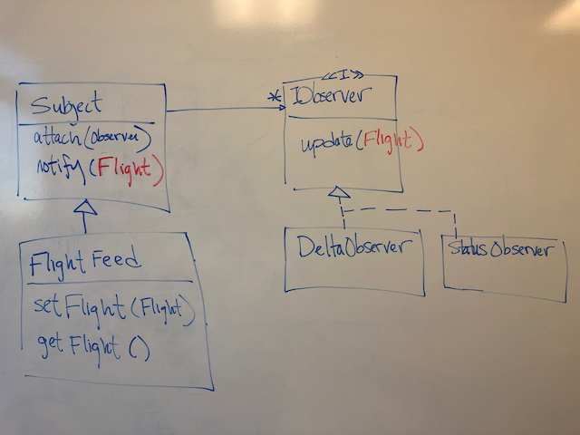

Complete the following exercise and submit the code [here](https://byu.instructure.com/courses/27157/assignments/965312).

## Description
The provided code contains the code for a program named FlightMonitor that selects a random airline flight that is currently in the air, and monitors its progress until it lands. The program’s main method is in the FlightMonitor class. Most of the program’s functionality is in the FlightFeed class. When you call the “start” method on a FlightFeed object, it downloads information about all currently in-air flights, and selects one of them to monitor. The selected flight’s status is stored in the FlightFeed object’s “flight” property. After initializing its “flight” property, every 60 seconds the FlightFeed object downloads the current status of the flight being monitored, and if the flight’s status has changed, it updates the value of its “flight” property to reflect the new status.

The starter code zip file has instructions for executing the starter code.

NOTE: You may see a null error when running the provided code from BYU Campus. If this is the case, open FlightFeed.ts and replace the URL with https://students.cs.byu.edu/~cs340ta/observer/index.php

NOTE: If you have a problem with "fetch" or "require" do the following.

1. Run: npm uninstall node-fetch
2. Run: npm uninstall @types/node-fetch
3. Run: npm install node-fetch@^2.6.1
4. Run: npm install --save-dev @types/node-fetch@2.5.12
5. Add the following to the problematic file(s): import require from "node-fetch";

## Specifications
After reading the provided code, modify it to use the Observer pattern as follows:

1. Create and implement a Subject base class and an Observer interface, as described in the Observer pattern.

2. Modify the FlightFeed class to be “observable” such that it notifies its observers each time its “flight” property changes.

3. Write an observer class that displays the status of the monitored flight every time its status changes, including the flight’s transponder id (icao24), call sign, country of origin, longitude, latitude, velocity, and altitude.

4. Write a second observer class that displays the deltas (or changes) in longitude, latitude, velocity, and altitude between status updates.

5. Integrate your observers into the FlightMonitor program so the output of the observers is displayed each time the flight status changes.

6. Remove the calls to console.log in FlightFeed (these are now replaced with output from your observers).

7. Upload the following .ts files (as separate files--not zipped) to Canvas:
   1. Your modified FlightFeed class
   2. Your modified FlightMonitor class
   3. The Observer interface you created
   4. The two Observer implementation classes you created
   5. The subject base class you created

The newly created classes can be either in separate files or some of them can be combined into one file.

